# Nodejs-Https-Proxy

 

## 简介：
http 和 https 代理，https 没有采用简单的隧道代理，而是使用了自签名证书以获取请求内容。


## 实现原理：
### 1. 设置系统代理
```
使用 node 的 exec 执行系统命令设置 http 和 https 代理
const { exec } = require('child_process');

const openHttpOsProxy = () => {
  exec('networksetup -setwebproxy "Wi-Fi" "127.0.0.1" 8000', {});
};
const openHttpsOsProxy = () => {
  exec('networksetup -setsecurewebproxy "Wi-Fi" "127.0.0.1" 8000', {});
};

const closeHttpOsProxy = () => {
  exec('networksetup -setwebproxystate "Wi-Fi" off', {});
};
const closeHttpsOsProxy = () => {
  exec('networksetup -setsecurewebproxystate "Wi-Fi" off', {});
};
```
在执行了 openHttpOsProxy 和 openHttpsOsProxy 方法后，可以看到系统中的代理被打开。
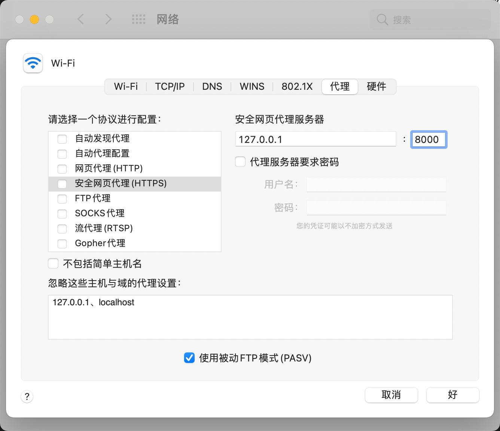


### 2.创建 http server 并转发请求
可以查看 httpProxy.js 文件代码，简单的进行请求转发。

我们进行浏览器测试：
刷新 http://nodejs.cn 页面，可以正常加载。也就是说 http 代理是成功的。
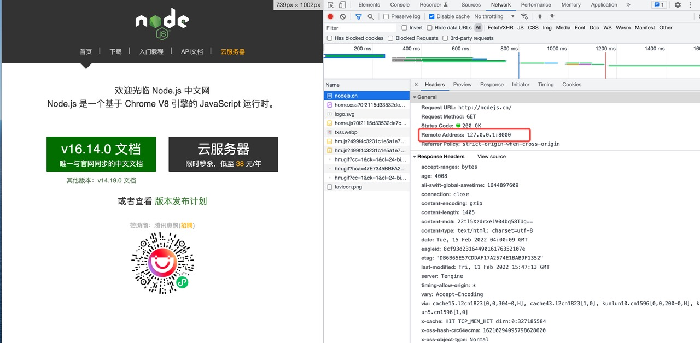

### 3.创建 https server 并转发请求
按照 http 相同的思路，本地创建 https server。但是不同于 http 明文传输， https 是有安全验证的。我们按照和 http 相同的思路是走不通的，请求建立不起来，被转发到本地的 https server 后连接就断了。

要想继续进行下去，就要了解 https 的加密原理
**https 加密原理：**
https 是基于对称加密、公私钥不对称加密、CA系统进行加密且可信任的信息传输。
- 对称加密：简单说就是有一个密钥，它可以加密一段信息，也可以对加密后的信息进行解密，和我们日常生活中用的钥匙作用差不多。
  对称加密的缺点在于：密钥在让双方知晓的情况下，又不能让其他人知道。那在这个传输过程中密钥被别人劫持到手了怎么办？之后他就能用密钥解开双方传输的任何内容了，所以这么做当然不行。
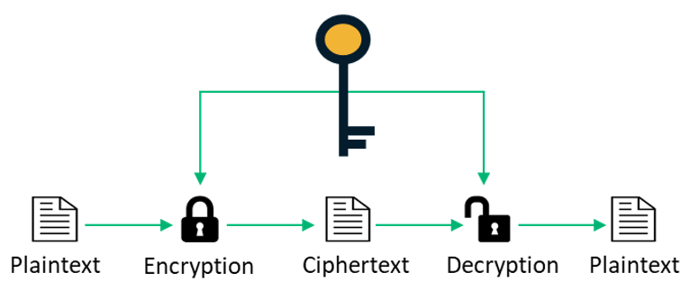


- 非对称加密：就是有两把密钥，通常一把叫做公钥、一把叫私钥，用公钥加密的内容必须用私钥才能解开，同样，私钥加密的内容只有公钥能解开。非对称加密在安全性上解决了对称加密的问题，即双方传输的公钥即使被窃听，也不能进行解密的。
  1. 服务器有公钥 A 和对应的私钥 A' ，浏览器有公钥 B 和对应的密钥 B'
  2. 服务器将公钥 A 通过明文传输给浏览器
  3. 浏览器将公钥 B 通过明文传输给服务器
  4. 服务器传输给浏览器的内容通过公钥 B 加密，浏览器使用密钥 B' 进行解密。
  5. 浏览器传输给服务器的内容通过公钥 A 加密，服务器使用密钥 A' 进行解密。

  **非对称加密的缺点在于：抛开其中的漏洞不谈，非对称加解密非常耗时，因此 https 没有采取这种方案。**
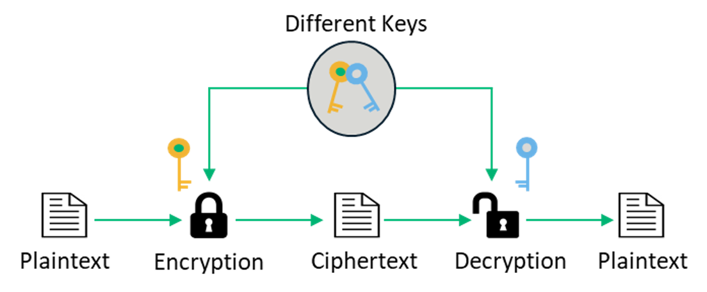

- 非对称加密+对称加密：我们结合对称加密和非对称加密的优缺点，我们使用非对称加密传输一个对称加密的密钥，确保对称加密的密钥没有被其他人监听，之后就可以使用对称加密来进行传输内容了。
  1. 浏览器有公钥 A 和对应的密钥 A'
  2. 浏览器将公钥 A 通过明文传输给服务器
  3. 服务器生成一个对称加密的密钥 K，并将 K 通过公钥 A 进行加密传输给浏览器
  4. 浏览器通过密钥 A' 解密后，得到对称加密的密钥 K
  5. 之后浏览器和服务器之间就可以通过对称加密的密钥 K 进行通信

> 非对称加密+对称加密看起来是兼顾了安全性和耗时。但是仍然存在一个致命的威胁。

#### 中间人攻击：
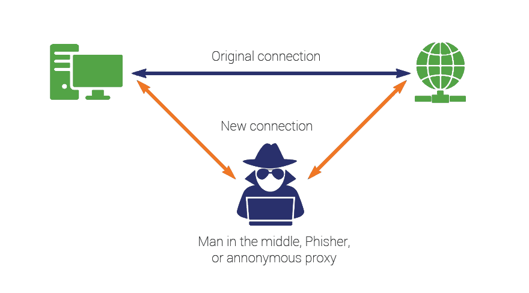
如果在数据传输过程中，中间人劫持到了数据，此时他的确无法得到浏览器生成的密钥 K，这个密钥本身被公钥 A 加密了，只有服务器才有私钥 A' 解开它，然而中间人却完全不需要拿到私钥 A' 就能干坏事了。
1. 某服务器有用于非对称加密的公钥A、私钥 A'。
2. 浏览器向网站服务器请求，服务器把公钥 A 明文给传输浏览器。
3. 中间人劫持到公钥 A，保存下来，把数据包中的公钥 A 替换成自己伪造的公钥 B（它当然也拥有公钥B对应的私钥 B’）。
4. 浏览器生成一个用于对称加密的密钥 K ，用公钥 B（浏览器无法得知公钥被替换了）加密后传给服务器。
5. 中间人劫持后用私钥 B’解密得到密钥 K，再用公钥 A 加密后传给服务器。
6. 服务器拿到后用私钥 A’ 解密得到密钥 K。

中间人攻击的问题在于：浏览器无法确定接收到的公钥是服务器的公钥

**那么如何确保浏览器收到的公钥是服务器的，而不是被劫持的中间人的呢？**

#### 数字签名证书：
那么这里采用了信任链，即公认的根证书颁发机构 CA，来为服务器和证书颁发机构颁发数字签名证书，之后证书颁发机构又可以为其他服务器颁发证书，一层一层的信任链。证书颁发机构的信任是经年累月积累的，浏览器和系统会内置信任的证书颁发机构和其公钥。

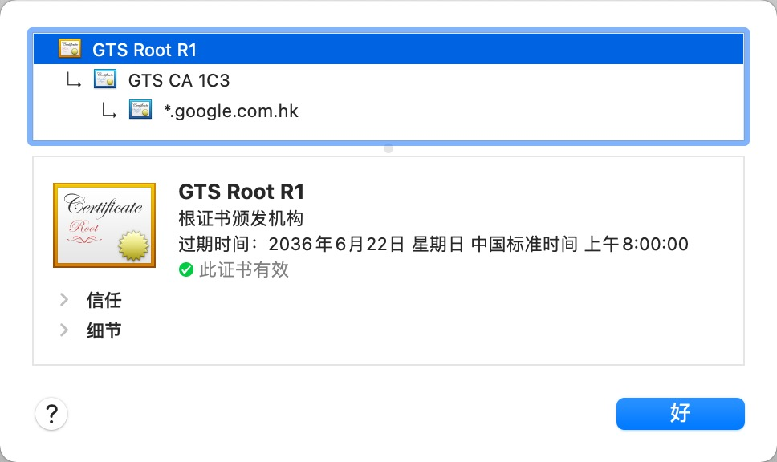
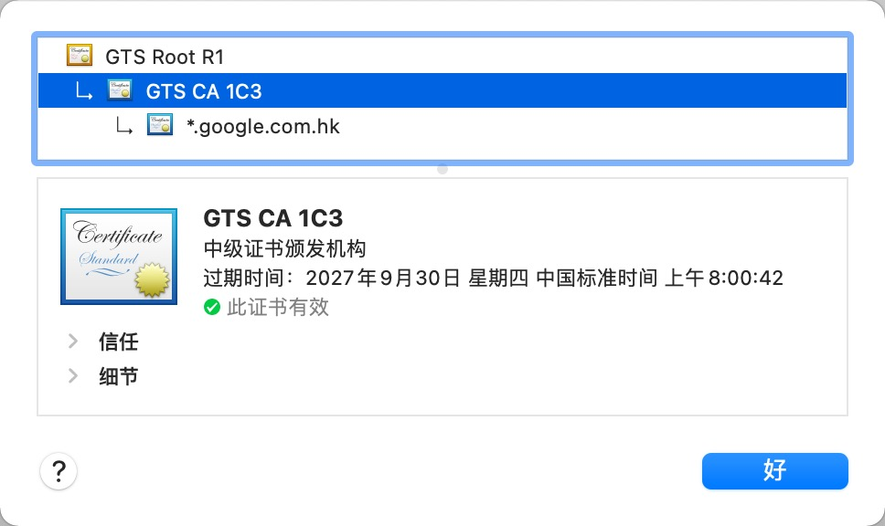
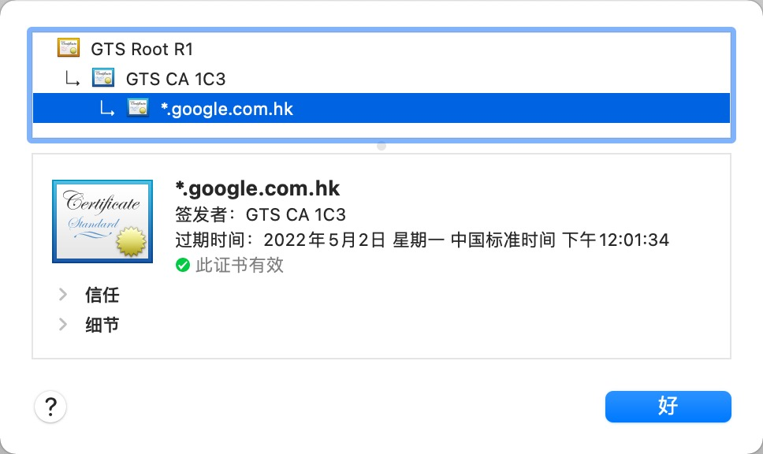


证书内包含了**服务器**的**公钥**和**域名**等信息，**证书颁发机构 CA** 会使用自己的**私钥**对**证书内容的 hash**进行加密作为签名 **(hash 是为了限定长度，非对称加密是有长度限制的)**

而浏览器拿到证书后，会使用证书的签名者的公钥对证书中的签名进行解密，并对比内容的 hash 值，以防止证书内容被修改。并且校验请求的域名和证书中的域名信息是否一致。
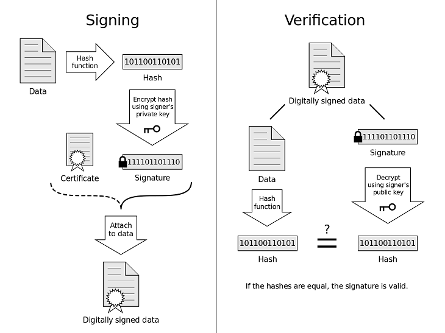

这样就确保了，浏览器中拿到的公钥是服务器的公钥，而没有被中间人劫持和修改。


自签名证书：
通过上面 https 加密原理的了解，https 请求都是需要验证证书的，并且验证证书主要是两个方面：1. 拥有受信任的证书颁发机构签名 2.证书中的域名要和请求的域名一致。

> 我们无法让证书颁发机构给我们的本地服务签名，那我们自己成为根证书颁发机构不就好了吗？

这里我们使用`node-forge` 生成自签名证书，成为根证书颁发机构，并且导入到系统钥匙串中，设置为始终信任。

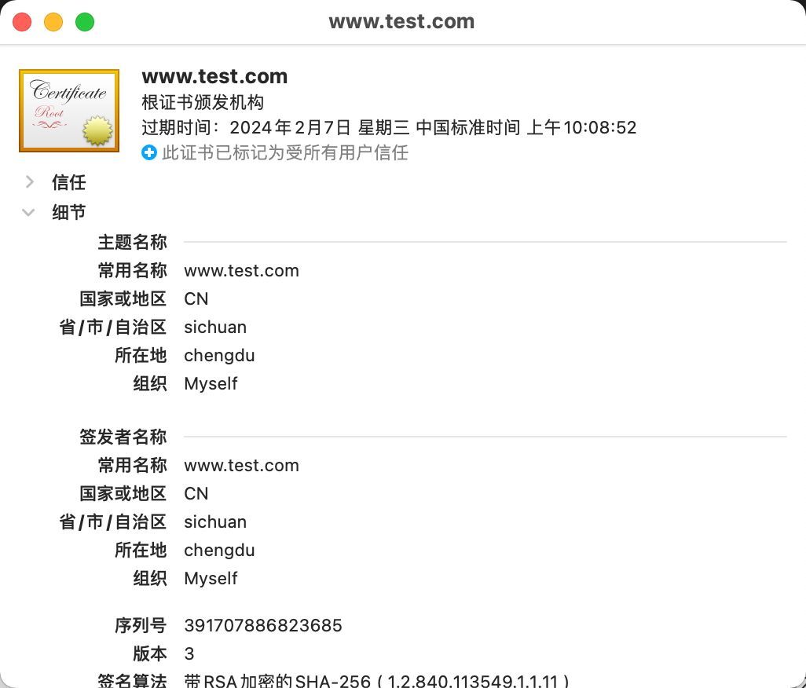

之后将需要代理的域名，生成证书并使用上面根证书签名。这样就可以实现伪造了请求域名的服务器证书。（这个服务器证书不需要导入系统钥匙串中）

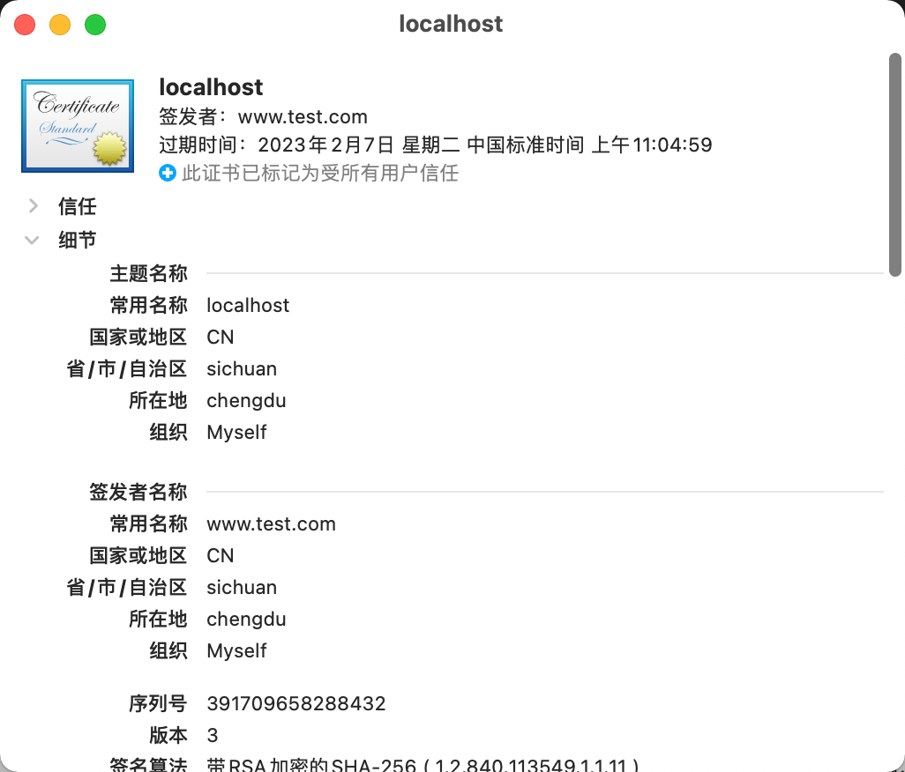


浏览器中的 https 请求会被转发到我们的本地 fakeServer 上，fakeServer 可以拿到完整的请求信息，再将请求信息请求真正的服务器，并将返回内容传给浏览器。从而实现了代理 https 请求，并且能够获取请求中的内容。

浏览器 https 请求在走代理时，会走到 http 服务的 connect 请求上（这个算是 http 协议的规定）。因此 http server 是必不可少的。
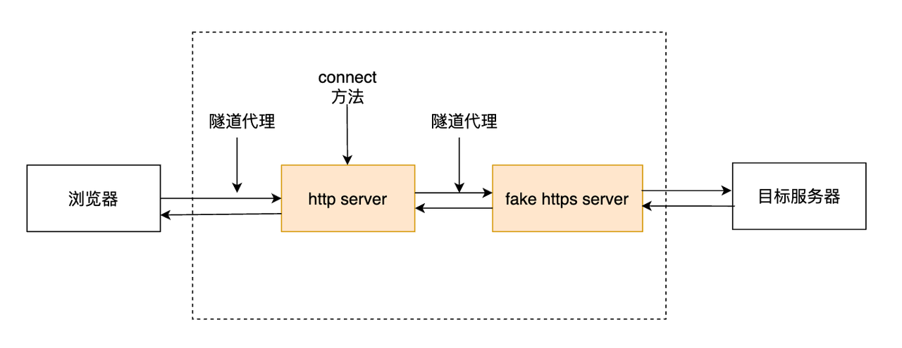


## 验证：
创建 fakeServer 中的证书域名 www.google.com.hk，并将请求返回为 “这里是 fakeServer 的返回”。

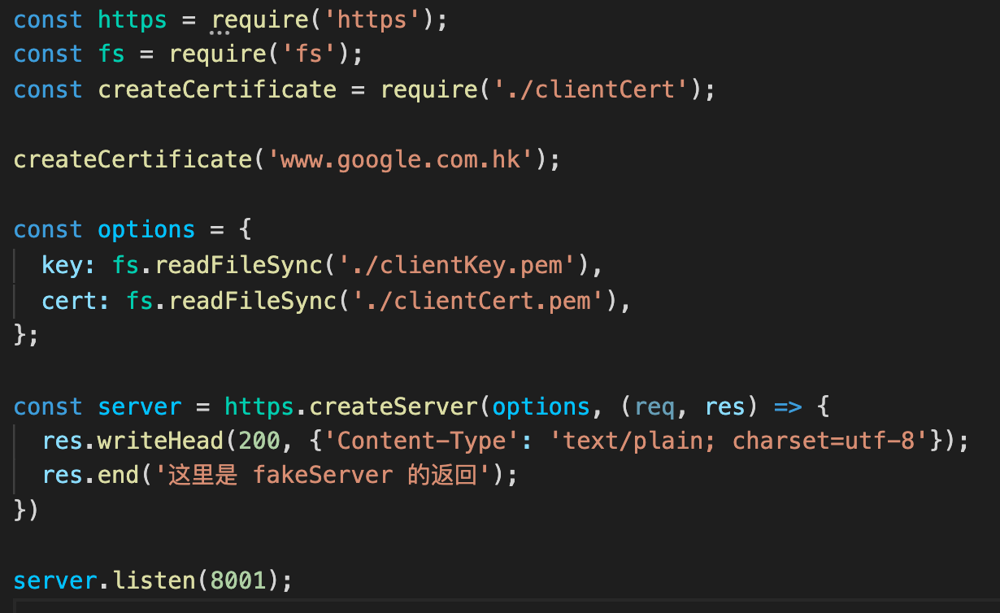

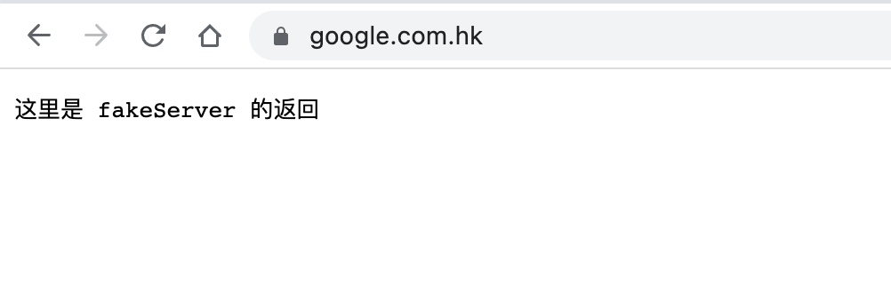
